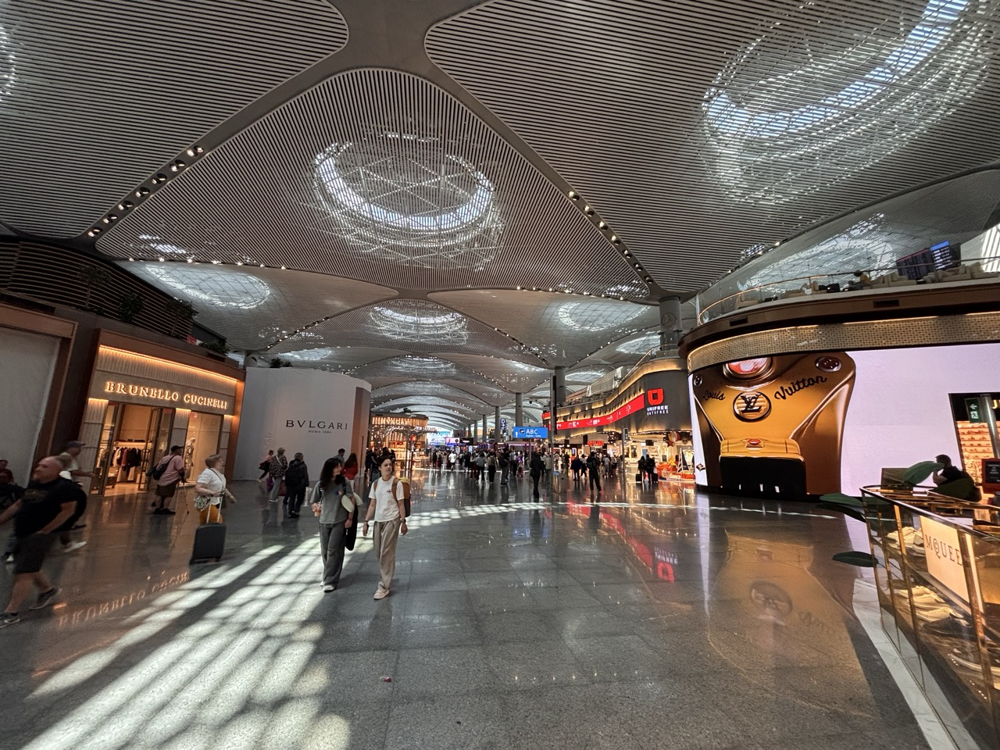
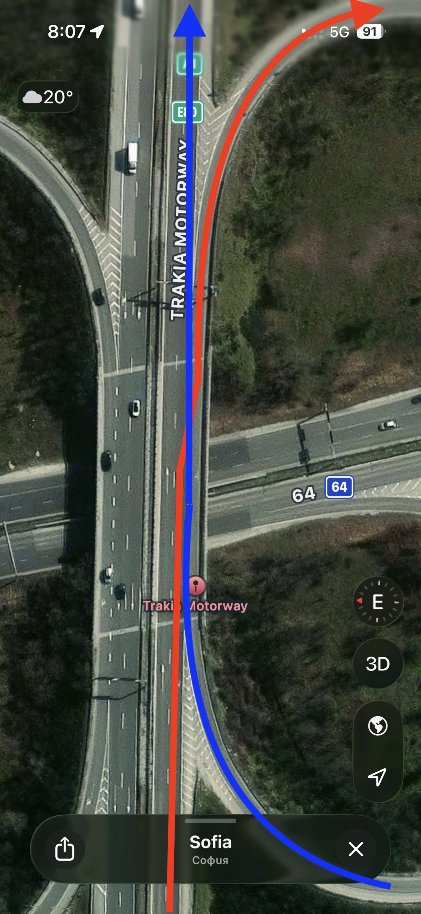

We hadn't been to Bulgaria since 2024 and since it was my wife's dad's 70th birthday we decided to go this year. We booked tickets towards the end of 2025, well before the War in Iran started.

Before leaving, and after the war started in Iran, there were a few airlines that started dropping routes to save on skyrocketing fuel prices.

Our original choice to go with Air New Zealand was canceled and we had to choose a different route, with ridiculously long transit times.

We asked our travel agent to find us a similar or better route. They came back with Turkish Airlines via Sydney, Kuala Lumpur, and Instanbul.

I'd heard little about Turkish Airlines, but the price wasn't subject to additional fees, and it was a good route with great transit times.

## Turkish Airlines 

Okay, here are the good and bad parts of my experience using Turkish Airlines.

For reference, I had the isle seat near the back of the plane, for three of the four flights.

To select our seats, it would have cost an extra $200 per person. We were automatically assigned for free.

The route was:
- Wellington to Sydney
- Sydney to Kuala Lumpur
- Kuala Lumpur to Istanbul
- Istanbul to Sofia

The plane was an A350-900.

We stopped in Kuala Lumpur for refueling, which took about an hour and a half. We had to disembark from the plane and go through security again, then into a holding pen.

The ground staff were very friendly, which was in contrast to the Turkish Airlines staff.

They also had free internet, which was superfast and straightforward to get going without having to give personal information.

It took about 38 hours in total from Wellington to Sofia.

### The bad

- some of the staff were a bit rude
  - refused to take rubbish away, "no I won't do that"
  - refused a second drink, "no we're not doing that"
- food was not great, but not as bad as Lufthansa, and to be honest, most airline food is fairly bad (and we don't book for the food)
- the seat was uncomfortable for 18 hours of sitting
- TV/movies on the in-flight entertainment were censored for language around sex/sexuality but not violence

### The good

- the in-flight entertainment system worked well
  - bluetooth audio
  - decent-sized screen
- other people were well-behaved

## Would I fly Turkish again?

They wouldn't be a first choice, but I'd consider them again if the price was really good.

## Istanbul airport 

### The bad

- prices were _super_ expensive
  - Burger King single Whopper burger (just for the burger) €17.90 (which is about $32NZD, for a Whopper)
  - standard looking kebab, medium 1780 Turkish lira (which is about €33.50, but I heard the lady said "...or €47.50") with medium chips and medium coke. That's about $80NZD, for a kebab.
- The lady at the Turkish Airlines counter had a sour attitude, as she probably had something better to do

### The good

- we saw a man heading back to Canada with his cat (the was called Coffee) in a front backpack

## Istanbul to Sofia 

### The bad

- we almost missed the plan because the girls were fluffing around in the toilet
- we sat in row 6, next to the engine which was very loud

### The good

- plane wasn't that full
- I wasn't expecting food being a 50min flight, but surprised with a nice mozzarella & tomato salad and a turkey sandwich
- Emily wanted to sit next to me on the plane

## Drive to Kazanlak

### The bad

- hire car company Europcar refused to hire the car because of my New Zealand driver's license not being internationally recognised apparently
- I had to spend $140 for an urgent international driver's license (not something I'd experienced before)
- we ignored Apple Maps suggestion of going on the B-roads and ended up in a traffic jam for an hour
- Bulgarian drivers drive similar to New Zealanders but are in a dire rush and are less scared of causing an accident
- The Bulgarian speed limits are confusing for non-residents. Bulgarian people I've talked to have said different things:
  - 130km/h on most roads, just slow down to 50km/h for towns
  - 120km/h on motorways, 112km/h on back roads, 50km/h near or in towns
  - I've just looked this up and it seems to be:
    - 140km/h on motorways with blue signs (such as Trakia motorway A1)
    - 120km/h on expressways with green signs  
    - 90km/h on national roads (roads outside of towns)
    - when you have to slow down for roadworks or intersection, you can speed back up to resume the speed as soon as you pass it (e.g., no speeds that tell you to resume)
- motorway interchanges are so dangerous.

### Example of motorway interchange

We, the red line are on the motorway and need to take the exit.

Them, the blue line, are on the motorway on-ramp and need to merge onto the motorway. 

What could possibly go wrong here, smdh:

### The potholes 

It wouldn't be Bulgaria without potholes.

The right-hand lane is often riddled with potholes (probably because of the many trucks), and the left-hand (overtaking) lane is full of black Mercedes & BMW that just need to be in front.

Doing north of 100 kmph and hitting a pothole is certainly an event to wake anyone sleeping.
